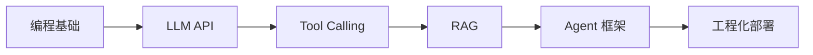

# AI Agent 搭建学习指南

> AI Agent（智能体）本质上是：**能感知环境 → 做决策 → 调用工具 → 完成任务** 的程序。本文档整理基础知识、学习路线与编程语言要求。

---

## 目录

- [一、需要掌握的基础知识](#一需要掌握的基础知识)
- [二、推荐学习路线](#二推荐学习路线)
- [三、编程语言要求](#三编程语言要求)
- [四、最小可行起步（1 周内）](#四最小可行起步1-周内)
- [五、常见误区](#五常见误区)

---

## 一、需要掌握的基础知识

### 1. 编程基础（必备）

| 领域 | 具体内容 |
|------|----------|
| 一门主语言 | 变量、函数、类、异步/并发、包管理 |
| 数据结构 | 列表、字典、队列、树、图（Agent 常用来组织记忆和任务） |
| API 开发 | HTTP、REST、JSON、WebSocket（与 LLM 和外部服务交互） |
| 基础工程 | Git、环境变量、日志、单元测试 |

### 2. 大语言模型（LLM）基础（核心）

- **Prompt Engineering**：系统提示词、Few-shot、Chain-of-Thought
- **模型能力边界**：上下文长度、幻觉、何时需要 RAG/工具
- **API 调用**：OpenAI / Anthropic / 国产大模型等的 Chat Completions API
- **参数理解**：temperature、max_tokens、streaming

### 3. Agent 核心概念（重点）

```
用户输入 → Agent 规划 → 选择工具 → 执行 → 观察结果 → 再规划 → 输出
```

需要理解：

- **ReAct**：推理（Reasoning）+ 行动（Acting）循环
- **Tool / Function Calling**：让模型调用搜索、数据库、代码执行等
- **Memory**：短期（对话历史）、长期（向量库）
- **Planning**：任务分解、多步执行
- **Multi-Agent**：多个 Agent 分工协作

### 4. RAG（检索增强生成）

Agent 经常需要「查资料再回答」：

- 文档切分（Chunking）、Embedding
- 向量数据库（Pinecone、Milvus、Chroma、pgvector）
- 检索策略与重排序

### 5. 框架与生态

常见框架（选 1～2 个深入即可）：

| 框架 | 语言 | 特点 |
|------|------|------|
| **LangChain / LangGraph** | Python / JS | 生态大，Agent 编排成熟 |
| **LlamaIndex** | Python | 偏 RAG 与数据索引 |
| **CrewAI** | Python | 多 Agent 协作 |
| **AutoGen** | Python | 微软，多 Agent 对话 |
| **Semantic Kernel** | C# / Python | 微软，企业向 |
| **Cursor SDK** | TypeScript / Python | 在 IDE/CI 里程序化跑 Agent |

### 6. 工程与运维

- **MCP（Model Context Protocol）**：统一连接外部工具/数据源
- **可观测性**：链路追踪、成本统计、失败重试
- **安全**：权限控制、Prompt 注入防护、敏感数据隔离
- **部署**：Docker、Serverless、队列（长任务异步）

### 7. 可选但加分

- 机器学习基础（不用很深，懂 Transformer 概念即可）
- 前端（若要做聊天 UI）
- 数据库与 SQL（Agent 查业务数据时常用）

---

## 二、推荐学习路线

预计周期：**3～6 个月**（有后端经验可压缩）

### 阶段 0：前置（2～4 周）

```
Python 或 TypeScript 基础 → HTTP/API → Git
```

若已有后端经验，可压缩到 1 周。

### 阶段 1：LLM 入门（2～3 周）

1. 注册一个大模型 API（OpenAI、DeepSeek、通义等）
2. 写第一个 Chat 程序（流式输出）
3. 练习 Prompt：角色设定、结构化输出（JSON）
4. 理解 Token、成本、上下文窗口

**里程碑**：能写一个带历史记录的简单聊天机器人。

### 阶段 2：Tool Calling（2～3 周）

1. 实现 Function Calling（查天气、搜网页、读文件）
2. 理解 ReAct 循环：模型决定 → 调工具 → 把结果塞回上下文
3. 处理错误：工具失败、超时、重试

**里程碑**：能做一个「能查资料并总结」的问答 Agent。

### 阶段 3：RAG（2～3 周）

1. 文档加载、切分、向量化
2. 接入向量库，实现「基于自家文档问答」
3. 把 RAG 作为 Agent 的一个 Tool

**里程碑**：能做一个读 PDF/知识库的客服 Agent。

### 阶段 4：框架与编排（3～4 周）

1. 学 **LangGraph** 或 **LangChain Agents**（状态机、多步流程）
2. 实现：规划 → 执行 → 反思 → 修正
3. 可选：多 Agent（研究员 + 写手 + 审稿）

**里程碑**：能做一个多步骤任务 Agent（如：调研 → 写报告 → 发邮件）。

### 阶段 5：工程化（持续）

1. 接入 MCP 或自定义工具生态
2. 加日志、监控、限流、鉴权
3. 部署到生产（API + 队列 + 缓存）
4. 评估：准确率、延迟、成本

**里程碑**：有一个可上线、可维护的 Agent 服务。

### 学习路径示意



---

## 三、编程语言要求

### 没有「唯一标准」，但有明显主流

| 语言 | 适合场景 | 建议 |
|------|----------|------|
| **Python** | 学习、原型、RAG、数据、AI 生态 | **首选**，资料最多 |
| **TypeScript / JavaScript** | Web Agent、全栈、Node 服务、Cursor SDK | 做产品/Web 时很实用 |
| **Java / Go** | 企业后端、高并发、现有 Java 团队 | 生态少，多通过 API 封装 |
| **C#** | .NET 企业、Semantic Kernel | 微软栈可选 |

### 实际建议

1. **零基础**：先学 **Python**，再学 LangChain/LangGraph。
2. **前端/全栈**：**TypeScript** + Vercel AI SDK / LangChain.js。
3. **Java 后端**（如 Spring 项目）：
   - 业务层仍用 Java
   - Agent 逻辑可用 Python 微服务，或通过 **HTTP 调 LLM API** 在 Java 里实现简单 Agent
   - 复杂编排更常见是 Python 侧，Java 负责鉴权、业务、持久化

### 语言要求总结

- **必须**：至少精通一门能调 HTTP API 的语言
- **推荐**：Python（AI 生态）+ 你业务栈语言（如 Java）
- **不必**：同时精通多门；Agent 核心是架构与 Prompt/工具设计，语言是载体

---

## 四、最小可行起步（1 周内）

若你想快速验证「会不会搭 Agent」，可按这个顺序：

| 时间 | 任务 |
|------|------|
| Day 1–2 | Python + `openai`（或国产 SDK）写一个对话脚本 |
| Day 3–4 | 加 1～2 个 Function（查时间、读本地文件） |
| Day 5–6 | 用 LangChain 把「对话 + 工具」串成 Agent |
| Day 7 | 加一个简单的 RAG（几份 Markdown 文档） |

---

## 五、常见误区

| 误区 | 正确理解 |
|------|----------|
| 要先学透深度学习 | Agent 开发偏工程，ML 理论浅尝即可 |
| 必须用最复杂框架 | 先用原生 API + 少量工具，再引入框架 |
| 语言选错就废了 | Python/TS 都能做，选和你项目一致的 |
| Agent = 聊天机器人 | Agent 重点是**自主规划 + 工具执行**，不只是对话 |

---

## 参考资源

- [LangChain 文档](https://python.langchain.com/)
- [LangGraph 文档](https://langchain-ai.github.io/langgraph/)
- [OpenAI Function Calling](https://platform.openai.com/docs/guides/function-calling)
- [Cursor SDK - TypeScript](https://cursor.com/docs/sdk/typescript)
- [Cursor SDK - Python](https://cursor.com/docs/sdk/python)
- [MCP 协议](https://modelcontextprotocol.io/)
